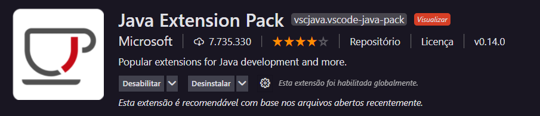
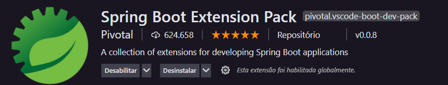
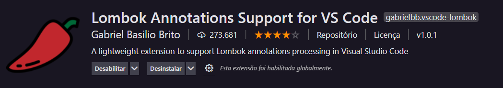
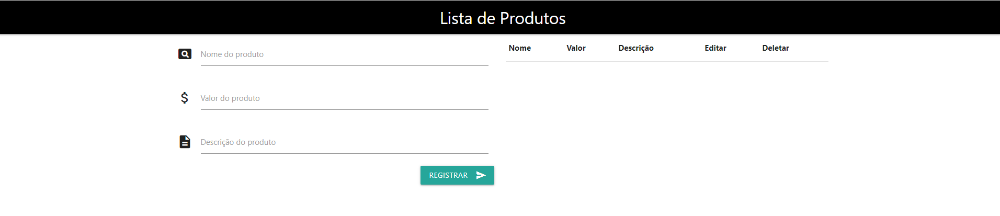

# CRUD :file_folder:
:bookmark_tabs: **CRUD com Java, React, NodeJS, Postman, Swagger e Docker.**

## Membros do Grupo 8

:boy: **- Lucas Alves Moreira**

:boy: **- Lucas Galdino**

:boy: **- Maurício Alves Moreira**

:boy: **- Vitor Geovani**

:boy: **- Tiago Soares**

:boy: **- Ryan Marinho**

### :information_source: Especificações do Projeto:

**Utilizando Java, React, Swagger e Docker desenvolvemos um CRUD de Lista de Produtos. Nessa lista você adiciona o nome, preço e a descrição do produto e todos esses dados ficam armazenados em uma DB (DataBase), criada pelo Docker.**

## 📌 Recursos usados neste projeto: 

</img> **Docker - (https://www.docker.com/get-started)**

</img> **Visual Studio Code -  (https://code.visualstudio.com/Download)**

</img> **React - (https://pt-br.reactjs.org/)**

</img> **Postman - (https://www.postman.com/)**

</img> **TablePlus - (https://www.tableplus.io/download)**

</img> **Swagger - (https://swagger.io/)**

</img> **NodeJS - (https://nodejs.org/en/)**

## :information_source: Dentro do Visual Studio Code, em especial, usamos as seguintes extensões:

  
  

  
 

  
  

  
 

  
  

  
 

  
  

### :information_source: **Para criar o seu próprio CRUD usando Java, React, NodeJS, Swagger, Postman e Docker, acesse o vídeo do canal Mahesh Kariya (https://www.youtube.com/watch?v=aYvU0vI_Tg0&t=2092s&ab_channel=MaheshKariya)**

### :information_source: **Acesse nossa demo no Netlify --> (https://crud-grupo8.netlify.app/)**

## :information_source: **Comandos e links importantes:**
### 📍 **Abra no Terminal**
**cd frontend**

### 📍 **Instale as dependências**
**npm install**

### 📍 **Rodar a página**
**npm start**

### 📍 **Abra em outro Terminal**
**cd backend**

### 📍 **Rodar o Projeto SpringBoot**
**mvn spring-boot:run**

### 📍 **Link para ver a API backend**
**(http://localhost:8080/swagger-ui.html)**

### 📍 **Link para ver o frontend**
**(http://localhost:3000/)**

### **Demo do nosso projeto:**

  
  

  
  

